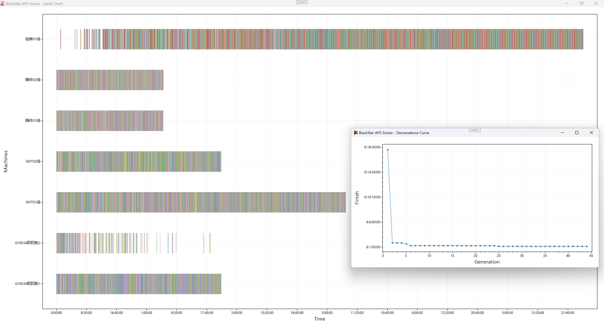

<h1>BlackStar, the Planning & Scheduling Solver</h1>

<b>BlackStar</b> is a general APS (advanced planning & scheduling) model and algorithm solution for various industries including aerospace mission planning, unmanned systems planning, vehicle fleet dispatching and manufactory planning. BlackStar uses a <b>continuous time</b> model to support any time precisions.

Contact Wechat official '真知科技' for license application, you should send the UID of your machine that can be queried by:

- <a href="UIDCheckerLinux.rar">UID Checker Linux</a> (the running command is: `dotnet BlackStar.UIDCheckCore.dll`，you need dotnet 8 runtime for Linux</a>)
- <a href="UIDCheckerWindows.rar">UID Checker Win</a> (directly run BlackStar.UIDCheckWin.exe, which needs dotnet 8 runtime Windows Desktop</a>)

<h1>BlackStar计划调度排产求解器</h1>

<b>BlackStar</b>是一个通用的先进计划排程APS模型和算法解决方案，支持航天任务、无人系统、车队调度、制造排产等诸多领域。BlackStar使用<b>连续时间</b>模型，可支持任意精度的时间。详见<a href="BlackStar2.pdf">技术白皮书</a>。

请联系微信公众号“真知科技”申请证书，之前需要检查机器的UID，请使用UID检查工具，并将显示的UID序列号发送过来：

- <a href="UIDCheckCore.rar">UID Checker Linux</a> (运行命令为 `dotnet BlackStar.UIDCheckCore.dll`，需要dotnet 8 Linux运行时</a> ) 
- <a href="UIDCheckWin.rar">UID Checker Win</a>（直接运行BlackStar.UIDCheckWin.exe文件，需要dotnet 8 Windows桌面运行时</a> ）

