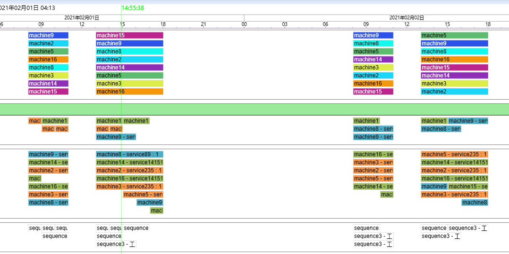
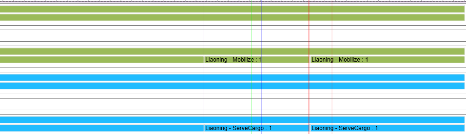
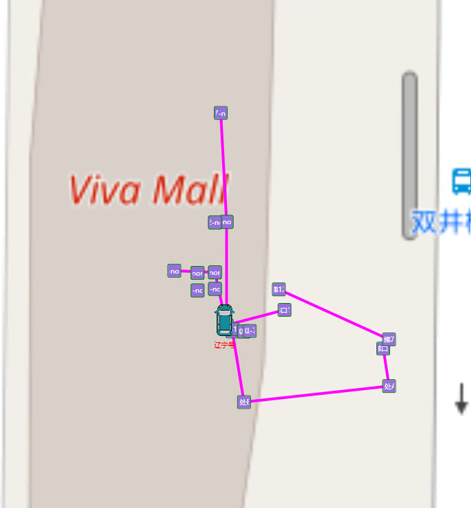

#BlackStar

BlackStar is a general APS (advanced planning & scheduling) model and algorithm solution for various industries including aerospace mission, unmanned systems and vehicle fleets. BlackStar uses a continuous time model for precision events, supporting Unified Scheduling Language (USL), rule mechanism and drag-n-drop operations in Gantt Charts to simplify applications in industries.

WIKI:<a href="https://github.com/AnakinCN/BlackStar-APS/wiki">https://github.com/AnakinCN/BlackStar-APS/wiki</a>

Contact <a href="mailto:anakin@seeingstones.cn">anakin@seeingstones.cn</a> for license application.

BlackStar是一个通用的先进计划排程APS模型和算法解决方案，支持航天任务、无人系统、车队调度等诸多行业。BlackStar使用连续时间模型处理事件的精确时间，支持统一规划语言USL、规则以及甘特图下的拖拽，以简化行业应用。

请联系<a href="mailto:anakin@seeingstones.cn">anakin@seeingstones.cn</a>申请证书。

WIKI:<a href="https://github.com/AnakinCN/BlackStar-APS/wiki">https://github.com/AnakinCN/BlackStar-APS/wiki</a>

anakincn add

